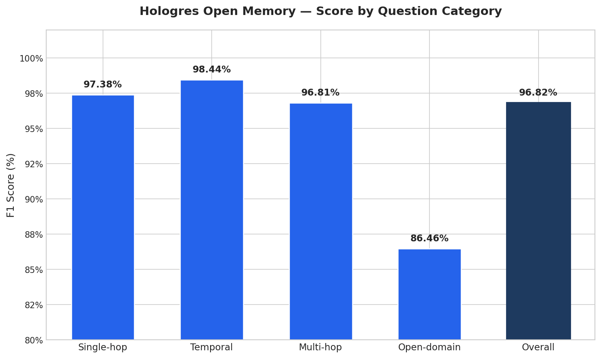

# Hologres Open Memory — LoCoMo Benchmark Results

## Overview

This repository contains the evaluation results of **Hologres Open Memory** on the [LoCoMo (Long-term Conversational Memory) benchmark](https://snap-research.github.io/locomo/), developed by SNAP Research.

LoCoMo is designed to evaluate long-term conversational memory systems through realistic, multi-session dialogues. Each conversation consists of approximately **300 turns** across **35 sessions**, totaling around **9,000 tokens** per conversation. The benchmark tests a system's ability to recall, reason over, and integrate information from extended conversational histories.

## Question Categories

The LoCoMo benchmark evaluates memory systems across four distinct question categories:

| Category | Description |
|----------|-------------|
| **Single-hop** | Direct fact recall — retrieving a specific piece of information mentioned in conversation |
| **Temporal** | Time-based reasoning — understanding event timing, sequences, and durations |
| **Multi-hop** | Multi-step reasoning — connecting multiple pieces of information across different parts of the conversation |
| **Open-domain** | Open-domain knowledge combined with conversation context — integrating world knowledge with conversational history |

## Results

### Evaluation Results

| Category | Correct | Total | Score |
|----------|---------|-------|-------|
| Single-hop | 819 | 841 | 97.38% |
| Temporal | 316 | 321 | 98.44% |
| Multi-hop | 273 | 282 | 96.81% |
| Open-domain | 83 | 96 | 86.46% |
| **Overall** | **1491** | **1540** | **96.82%** |


## Key Highlights

- **Overall score of 96.82%** across 1,540 evaluation questions
- **Exceptional Temporal reasoning at 98.44%** — near-perfect accuracy on time-based reasoning tasks
- **Strong Single-hop performance at 97.38%** — highly reliable direct fact recall
- **Robust Multi-hop reasoning at 96.81%** — effective at connecting information across conversation sessions
- **Open-domain at 86.46%** — solid integration of world knowledge with conversational context

## Reproducibility

Raw evaluation results are available in this repository:

- `locomo_result.json` — Evaluation results (1,540 questions)

The JSON file contains an array of evaluation records with the following fields:

| Field | Description |
|-------|-------------|
| `question_index` | Index of the question in the LoCoMo dataset |
| `question` | The evaluation question |
| `ground_truth` | Expected answer |
| `predicted` | System-generated answer |
| `score` | Binary score (0 or 1) |
| `category` | Question category (1=Multi-hop, 2=Temporal, 3=Open-domain, 4=Single-hop) |

To reproduce the score calculations, run:

```bash
python calculate_scores.py
```

## Visualizations



## References

| System | Benchmark Score Source |
|--------|----------------------|
| MemoryLake | [memorylake-ai/memorylake-locomo-benchmark](https://github.com/memorylake-ai/memorylake-locomo-benchmark) |
| Mem0 (2026) | [mem0.ai/research](https://mem0.ai/research-5) |
| EverMemOS | [arxiv.org/pdf/2601.02163](https://arxiv.org/pdf/2601.02163) |
| ByteRover 2.0 | [byterover.dev/blog - Benchmark AI Agent Memory](https://www.byterover.dev/blog/benchmark-ai-agent-memory) |
| Honcho | [plasticlabs.ai/blog - Benchmarking Honcho](https://plasticlabs.ai/blog/research/Benchmarking-Honcho) |
| Zep | [getzep - research](https://www.getzep.com/research/) |
| MemOS | [memorylake-ai/memorylake-locomo-benchmark](https://github.com/memorylake-ai/memorylake-locomo-benchmark) |
| LoCoMo Benchmark | [snap-research/locomo (ACL 2024)](https://github.com/snap-research/locomo) |
