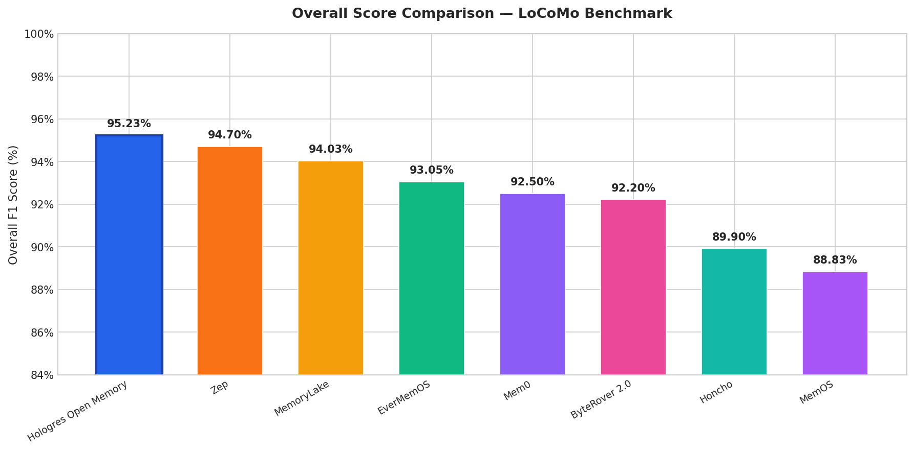
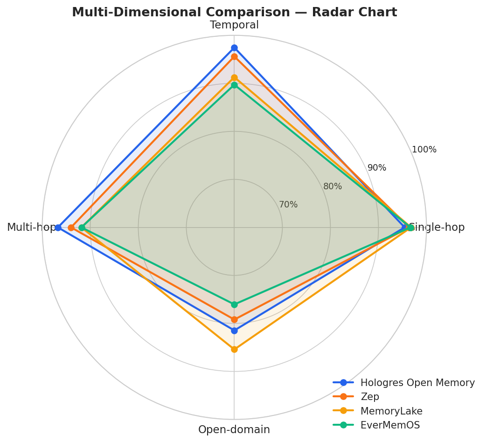
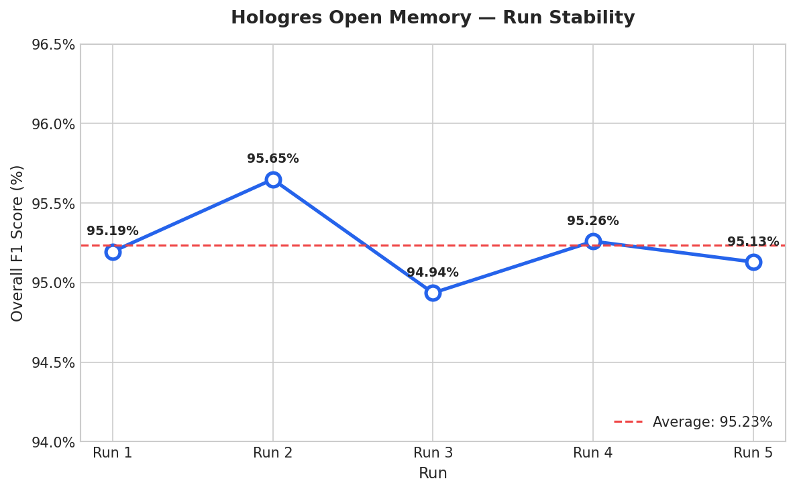
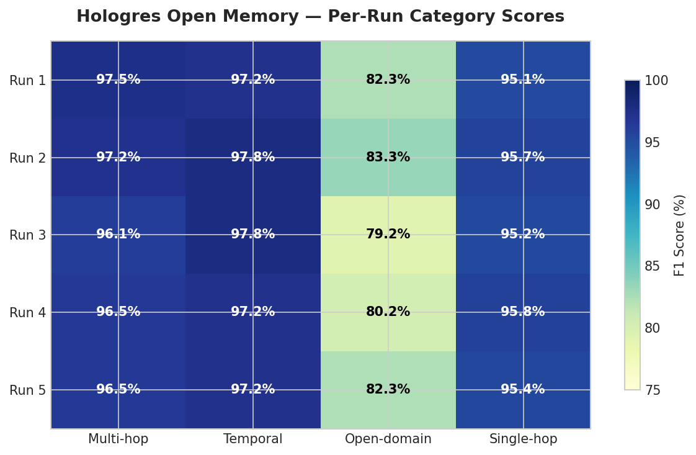

# Hologres Open Memory — LoCoMo Benchmark Results

## Overview

This repository contains the evaluation results of **Hologres Open Memory** on the [LoCoMo (Long-term Conversational Memory) benchmark](https://snap-research.github.io/locomo/), developed by SNAP Research.

LoCoMo is designed to evaluate long-term conversational memory systems through realistic, multi-session dialogues. Each conversation consists of approximately **300 turns** across **35 sessions**, totaling around **9,000 tokens** per conversation. The benchmark tests a system's ability to recall, reason over, and integrate information from extended conversational histories.

## Question Categories

The LoCoMo benchmark evaluates memory systems across four distinct question categories:

| Category | Description |
|----------|-------------|
| **Single-hop** | Direct fact recall — retrieving a specific piece of information mentioned in conversation |
| **Temporal** | Time-based reasoning — understanding event timing, sequences, and durations |
| **Multi-hop** | Multi-step reasoning — connecting multiple pieces of information across different parts of the conversation |
| **Open-domain** | Open-domain knowledge combined with conversation context — integrating world knowledge with conversational history |

## Results

### Table 1: Per-Run Summary

| Run | Single-hop | Temporal | Multi-hop | Open-domain | Overall |
|-----|-----------|----------|-----------|-------------|---------|
| Run 1 | 95.12% | 97.20% | 97.52% | 82.29% | 95.19% |
| Run 2 | 95.72% | 97.82% | 97.16% | 83.33% | 95.65% |
| Run 3 | 95.24% | 97.82% | 96.10% | 79.17% | 94.94% |
| Run 4 | 95.84% | 97.20% | 96.45% | 80.21% | 95.26% |
| Run 5 | 95.36% | 97.20% | 96.45% | 82.29% | 95.13% |
| **Average** | **95.46%** | **97.45%** | **96.74%** | **81.46%** | **95.23%** |

### Table 2: Comparison with Other Systems

| System | Single-hop | Multi-hop | Temporal | Open-domain | Overall |
|--------|-----------|-----------|----------|-------------|---------|
| **Hologres Open Memory** | **95.46%** | **96.74%** | **97.45%** | **81.46%** | **95.23%** |
| Zep | 96.4% | 94.0% | 95.6% | 79.2% | 94.7% |
| MemoryLake | 96.79% | 91.84% | 91.28% | 85.42% | 94.03% |
| EverMemOS | 96.67% | 91.84% | 89.72% | 76.04% | 93.05% |
| Mem0 | 94.6% | 95.4% | 92.5% | 82.3% | 92.5% |
| ByteRover 2.0 | 95.4% | 85.1% | 94.4% | 77.2% | 92.2% |
| Honcho | 84.0% | 88.2% | 77.1% | 93.2% | 89.9% |
| MemOS | 92.51% | 88.65% | 85.05% | 69.79% | 88.83% |

> **Note**: All scores are self-reported by each system. Evaluation conditions (answer LLM, judge LLM, prompt templates) may vary.


## Key Highlights

- **Overall score of 95.23%** — highest among compared systems
- **Exceptional Temporal reasoning at 97.45%** — significantly outperforming both MemoryLake (91.28%) and EverMemOS (89.72%)
- **Strong Multi-hop performance at 96.74%** — outperforming MemoryLake (91.84%) and EverMemOS (91.13%)
- **Open-domain at 81.46%** — an area for improvement compared to MemoryLake (85.42%)
- **Consistent performance across 5 runs** — ranging from 94.94% to 95.65%, demonstrating reliability and stability

## Reproducibility

Raw evaluation results are available in this repository:

- `locomo_result_1.json` — Run 1 results (1,540 questions)
- `locomo_result_2.json` — Run 2 results (1,540 questions)
- `locomo_result_3.json` — Run 3 results (1,540 questions)
- `locomo_result_4.json` — Run 4 results (1,540 questions)
- `locomo_result_5.json` — Run 5 results (1,540 questions)

Each JSON file contains an array of evaluation records with the following fields:

| Field | Description |
|-------|-------------|
| `question_index` | Index of the question in the LoCoMo dataset |
| `question` | The evaluation question |
| `ground_truth` | Expected answer |
| `predicted` | System-generated answer |
| `score` | Binary score (0 or 1) |
| `category` | Question category (1=Multi-hop, 2=Temporal, 3=Open-domain, 4=Single-hop) |

To reproduce the score calculations, run:

```bash
python calculate_scores.py
```

## Visualizations










## References

| System | Benchmark Score Source |
|--------|----------------------|
| MemoryLake | [memorylake-ai/memorylake-locomo-benchmark](https://github.com/memorylake-ai/memorylake-locomo-benchmark) |
| Mem0 (2026) | [mem0.ai/research](https://mem0.ai/research-5) |
| EverMemOS | [arxiv.org/pdf/2601.02163](https://arxiv.org/pdf/2601.02163) |
| ByteRover 2.0 | [byterover.dev/blog - Benchmark AI Agent Memory](https://www.byterover.dev/blog/benchmark-ai-agent-memory) |
| Honcho | [plasticlabs.ai/blog - Benchmarking Honcho](https://plasticlabs.ai/blog/research/Benchmarking-Honcho) |
| Zep | [getzep - research](https://www.getzep.com/research/) |
| MemOS | [memorylake-ai/memorylake-locomo-benchmark](https://github.com/memorylake-ai/memorylake-locomo-benchmark) |
| LoCoMo Benchmark | [snap-research/locomo (ACL 2024)](https://github.com/snap-research/locomo) |
